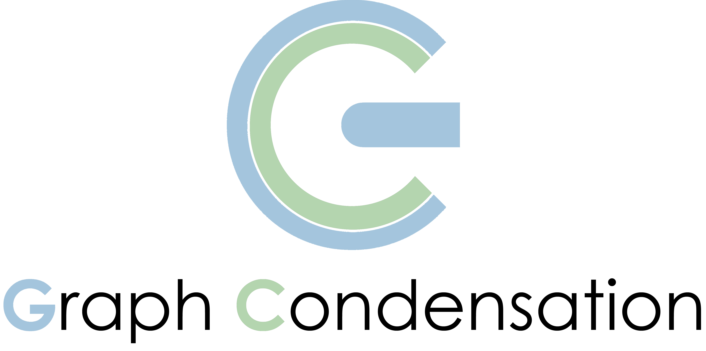

# Awesome-Graph-Condensation

  

     

- Given that graph data consists of a massive number of nodes and their relationships,  **Graph Condensation (GC)** solves the problem of: How to condense large-scale graphs into **smaller** yet **informative** ones.

This repository contains a list of papers who shares a common motivation of GC; We categorize them based on their aspect of making condensed graphs **informative**, i.e., what information of the original graph was designed to preserve, the graph properties (graph guided) or the trained models' capabilities (model guided).

We will try to make this list updated. If you found any error or any missed paper, please don't hesitate to open an issue or pull request.

### Paper List
|    Survey Paper    |  Conference  |
|  :---------  | :------:  |
| :triangular_flag_on_post: [**A Survey on Graph Condensation**](https://arxiv.org/abs/2402.02000) | arXiv 2024 |
| [Graph Condensation: A Survey](https://arxiv.org/abs/2401.11720) | arXiv 2024 |
| [A Comprehensive Survey on Graph Reduction: Sparsification, Coarsening, and Condensation](https://cse.msu.edu/~jinwei2/files/Survey_GraphReduction.pdf) | arXiv 2024 |
|  | arXiv 2024 |

|Category |   Paper    |  Method  |  Conference  |  Code |
| :------:|  :---------  | :------:  | :------: | :------: |
|Graph Guided | [Graph reduction with spectral and cut guarantees](https://arxiv.org/pdf/2211.07136.pdf) | GC | JMLR 2019 | [Python](https://github.com/loukasa/graph-coarsening/tree/v1.1) |
|Graph Guided | [A unifying framework for spectrum-preserving graph sparsification and coarsening](https://proceedings.neurips.cc/paper/2019/hash/cd474f6341aeffd65f93084d0dae3453-Abstract.html) | ReduceG | NIPS 2019 | [Python](https://github.com/TheGravLab/A-Unifying-Framework-for-Spectrum-Preserving-Graph-Sparsification-and-Coarsening) |
|Graph Guided | [Scaling up graph neural networks via graph coarsening](https://arxiv.org/pdf/2106.05150.pdf) | SCAL | KDD 2021 | [Pytorch](https://github.com/szzhang17/Scaling-Up-Graph-Neural-Networks-Via-Graph-Coarsening) |
|Graph Guided | [GraphZoom: A multi-level spectral approach for accurate and scalable graph embedding](https://arxiv.org/pdf/1910.02370.pdf) | GraphZoom | ICLR 2020 | [Python](https://github.com/cornell-zhang/GraphZoom) |
|Graph Guided | [Graph coarsening with preserved spectral properties](https://arxiv.org/pdf/1802.04447.pdf) | SC | ICAIS 2020 | [Python](https://github.com/yuj-umd/spectral-coarsening) |
|Graph Guided | [Featured graph coarsening with similarity guarantees](https://proceedings.mlr.press/v202/kumar23a.html) | FGC | ICML 2023 | - |
|Graph Guided | [Cat: Balanced continual graph learning with graph condensation](https://arxiv.org/abs/2309.09455) | CaT | ICDM 2023 | [Pytorch](https://github.com/superallen13/CaT-CGL) |
|Graph Guided | [Unsupervised learning of graph hierarchical abstractions with differentiable coarsening and optimal transport](https://ojs.aaai.org/index.php/AAAI/article/view/17072) | OTC | AAAI 2021 | [Pytorch](https://github.com/matenure/OTCoarsening) |
|Modle Guided | [Graph coarsening via convolution matching for scalable graph neural network training](https://arxiv.org/abs/2312.15520) | ConvMatch | aiXiv 2023 | [Pytorch](https://github.com/amazon-science/convolution-matching) |
|Modle Guided | [Graph Condensation via Receptive Field Distribution Matching](https://arxiv.org/abs/2206.13697) | GCDM | aiXiv 2022 | - |
|Modle Guided | [Kernel Ridge Regression-Based Graph Dataset Distillation](https://dl.acm.org/doi/abs/10.1145/3580305.3599398) | KiDD | KDD 2023 | [Pytorch](https://github.com/pricexu/KIDD) |
|Modle Guided | [FedGKD: Unleashing the Power of Collaboration in Federated Graph Neural Networks](https://arxiv.org/abs/2309.09517) | FedGKD | aiXiv 2023 | - |
|Modle Guided | [Fast graph condensation with structure-based neural tangent kernel](https://arxiv.org/abs/2310.11046) | GC-SNTK | aiXiv 2023 | [Pytorch](https://github.com/amazon-science/convolution-matching) |
|Modle Guided | [Structure-free Graph Condensation: From Large-scale Graphs to Condensed Graph-free Data](https://arxiv.org/abs/2306.02664) | SFGC | NIPS 2023 | [Pytorch](https://github.com/Amanda-Zheng/SFGC) |
|Modle Guided | [Condensing Graphs via One-Step Gradient Matching](https://dl.acm.org/doi/abs/10.1145/3534678.3539429) | DosCond | KDD 2022 | [Pytorch](https://github.com/ChandlerBang/GCond) |
|Modle Guided | [Graph condensation for graph neural networks](https://arxiv.org/abs/2110.07580) | GCond | ICLR 2021 | [Pytorch](https://github.com/ChandlerBang/GCond) |
|Modle Guided | [Attend who is weak: Enhancing graph condensation via cross-free adversarial training](https://arxiv.org/abs/2311.15772) | GroC | aiXiv 2023 | - |
|Modle Guided | [Faster Hyperparameter Search for GNNs via Calibrated Dataset Condensation](https://openreview.net/forum?id=ohQPU2G3r3C) | HCDC | OpenReview 2023 | - |
|Modle Guided | [Multiple sparse graphs condensation](https://www.sciencedirect.com/science/article/abs/pii/S0950705123006548) | MSGC | Knowledge-Based Systems 2023 | - |
|Modle Guided | [Graph coarsening via convolution matching for scalable graph neural network training](https://arxiv.org/abs/2312.15520) | ConvMatch | aiXiv 2023 | [Pytorch](https://github.com/amazon-science/convolution-matching) |
|Modle Guided | [Graph coarsening via convolution matching for scalable graph neural network training](https://arxiv.org/abs/2312.15520) | ConvMatch | aiXiv 2023 | [Pytorch](https://github.com/amazon-science/convolution-matching) |
|Modle Guided | [Graph coarsening via convolution matching for scalable graph neural network training](https://arxiv.org/abs/2312.15520) | ConvMatch | aiXiv 2023 | [Pytorch](https://github.com/amazon-science/convolution-matching) |
|Modle Guided | [Graph coarsening via convolution matching for scalable graph neural network training](https://arxiv.org/abs/2312.15520) | ConvMatch | aiXiv 2023 | [Pytorch](https://github.com/amazon-science/convolution-matching) |
|Modle Guided | [Graph coarsening via convolution matching for scalable graph neural network training](https://arxiv.org/abs/2312.15520) | ConvMatch | aiXiv 2023 | [Pytorch](https://github.com/amazon-science/convolution-matching) |
|Modle Guided | [Graph coarsening via convolution matching for scalable graph neural network training](https://arxiv.org/abs/2312.15520) | ConvMatch | aiXiv 2023 | [Pytorch](https://github.com/amazon-science/convolution-matching) |
|Modle Guided | [Graph coarsening via convolution matching for scalable graph neural network training](https://arxiv.org/abs/2312.15520) | ConvMatch | aiXiv 2023 | [Pytorch](https://github.com/amazon-science/convolution-matching) |